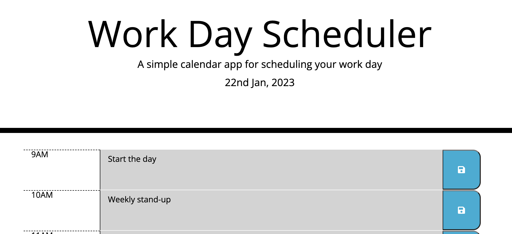

# Simple-Daily-Planner

## Description 
This daily planner app was deisgned using the third party API's jQuery and Moment. jQuery is used to traverse the DOM and make the page reactive. Users can add a task for an hour of the working day between 9AM and 5PM, this is saved to local storage so perists between page refreshes and is cleared at the begining of a new day automatically. 

The dataset of some HTML elements is used to populate the page with saved tasks and to modify the CSS of each row depending on its time relative to the current time. 

```javascript
    if (rowTime < currentHour) {
            textArea.setAttribute("class", "past description col-9");
        } else if (rowTime === currentHour) {
            textArea.setAttribute("class", "present description col-9");
        }
```

## Deployed Site
https://roberttaylor94.github.io/Simple-Daily-Planner/


